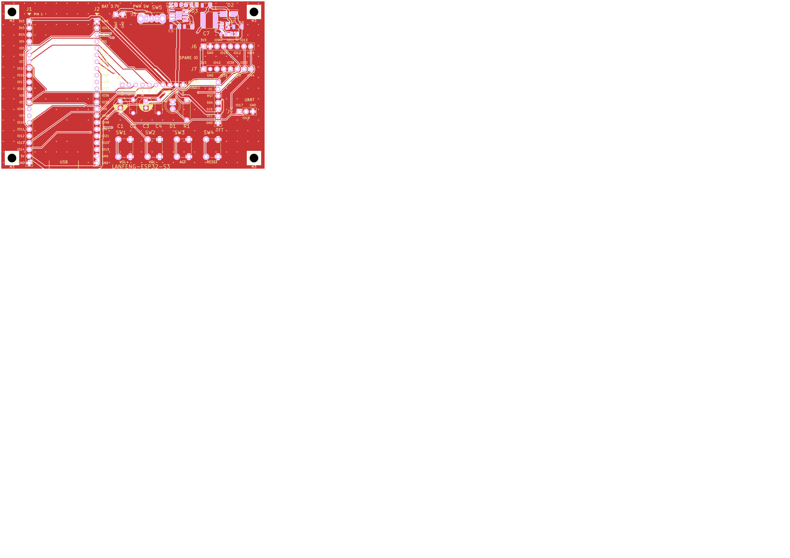
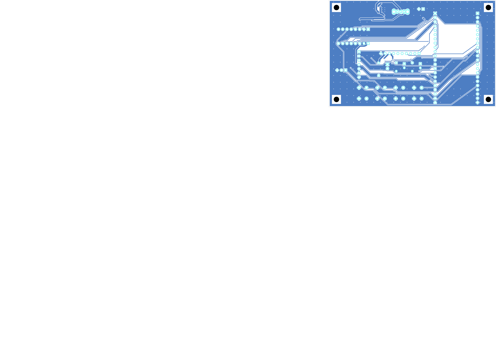

# LANFENG-ESP32-S3 载板 (Carrier Board)

把 **YD-ESP32-S3 开发板 + ES8311 语音模块 + 1.77" SPI TFT + 3.7V 锂电池** 从一堆杜邦线变成一块插起来就能用的积木。

- 板子尺寸 **100 × 64 mm**，2 层，板厚 1.6 mm
- 四角 **4 × Ø3.2 mm 非金属化螺丝孔**（NPTH，无铜），孔心内缩 4.5 mm
- 板高 64 mm 是**按开发板 USB 边缘定的**：开发板本体到 y 63.25 为止，Type-C 口整个悬在板外，装壳不挡
- 连接器：**排母为主 + 排针引出**
  - 开发板 2 × 1×22 排母（J1/J2）
  - 语音模块 1×10 排母（J3）
  - 显示屏 1×7 排针（J4）、电池 1×2 排针（J5）
  - 备用 IO 1×8 ×2（J6/J7）、串口 1×3（J9）
- 语音模块**平放**在板上（J3 上方整块区域无元件、无过孔）
- 四个按键**同在一条底边**：音量+、音量−、激活、Reset
- **板载 3.7V 锂电充电 + 升压**，USB 与电池可同时插，自动由 USB 供电




---

## 一、接线表

### 1. 开发板插到 J1 / J2（**照丝印插，别照原理图**）

两列排母间距 **25.40 mm**，脚距 2.54 mm，每列**最上方都是第 1 脚**。

> ⚠️ **重要**：开发板原理图 `J2` 的引脚编号与实物丝印**差一位**（原理图 pin1 = TXD0，实物最上方是 GND）。本载板**以实物丝印为准**，丝印上每一脚都印了 GPIO 号，插之前对一下即可。

**J1（左列，上→下）**

| 脚 | 丝印 | 脚 | 丝印 | 脚 | 丝印 |
|---|---|---|---|---|---|
| 1 | 3V3 | 9 | IO16 | 17 | IO11 |
| 2 | 3V3 | 10 | IO17 | 18 | IO12 |
| 3 | RST | 11 | IO18 | 19 | IO13 |
| 4 | IO4 | 12 | IO8 | 20 | IO14 |
| 5 | IO5 | 13 | IO3 | 21 | **5V** |
| 6 | IO6 | 14 | IO46 | 22 | GND |
| 7 | IO7 | 15 | IO9 | | |
| 8 | IO15 | 16 | IO10 | | |

**J2（右列，上→下）**

| 脚 | 丝印 | 脚 | 丝印 | 脚 | 丝印 |
|---|---|---|---|---|---|
| 1 | GND | 9 | IO39 | 17 | IO47 |
| 2 | IO43 | 10 | IO38 | 18 | IO21 |
| 3 | IO44 | 11 | IO37 | 19 | IO20 |
| 4 | IO1 | 12 | IO36 | 20 | IO19 |
| 5 | IO2 | 13 | IO35 | 21 | GND |
| 6 | IO42 | 14 | IO0 | 22 | GND |
| 7 | IO41 | 15 | IO45 | | |
| 8 | IO40 | 16 | IO48 | | |

> **J1-21 是整块板的 5V 入口**：开发板的 Type-C 收进来的 5V 从这里回灌到载板的 `+5V` 轨，
> 给功放、指示灯和充电电路供电。所以**充电宝要插在开发板的 Type-C 口**，不是载板。

### 2. 语音模块插到 J3（1×10 排母，模块**平放**）

丝印按**模块自己的引脚名**印，照着插就行：

| J3 | 1 | 2 | 3 | 4 | 5 | 6 | 7 | 8 | 9 | 10 |
|---|---|---|---|---|---|---|---|---|---|---|
| 丝印 | SDA | SCL | MCK | BCK | DI | WS | DO | 3V3 | VCC | GND |
| 接到 | GPIO1 | GPIO2 | GPIO3 | GPIO15 | GPIO7 | GPIO16 | GPIO6 | 3V3 | **5V** | GND |

> 注意 **VCC 接 5V**（模块功放取 5V），**3V3 接 3V3**，两个别接反。

### 3. 显示屏用排线引到 J4（1×7 排针）

| J4 | 1 | 2 | 3 | 4 | 5 | 6 | 7 |
|---|---|---|---|---|---|---|---|
| 丝印 | CS | DC | RST | SDA | SCK | VCC | GND |
| 接到 | GPIO41 | GPIO40 | GPIO45 | GPIO47 | GPIO21 | 3V3 | GND |

### 4. 电池接到 J5（1×2 排针，2.54 mm）

| J5 | 1 | 2 |
|---|---|---|
| 丝印 | **BAT** | GND |

接 **3.7V 聚合物锂电池**（2.54 mm 插头，红=BAT、黑=GND）。
**BAT 这一脚是电池的裸正极**，在 SW5 之前——关掉 SW5 就彻底断开电池放电，但**充电不受影响**（TP4056 直接挂在电池上）。

> v1 这一脚印的是 `+5V`，因为电池当时是直接并在 5V 轨上的。v2 中间加了升压，所以标签必须改。

### 5. 备用 IO（J6 / J7）与串口（J9）

每个 GPIO **只引一次**，两个排针没有重复脚位。

**J6 —— J1 侧空余脚**

| 脚 | 1 | 2 | 3 | 4 | 5 | 6 | 7 | 8 |
|---|---|---|---|---|---|---|---|---|
| 丝印 | 3V3 | GND | IO9 | IO10 | IO11 | IO12 | IO13 | IO14 |

**J7 —— J2 侧空余脚**

| 脚 | 1 | 2 | 3 | 4 | 5 | 6 | 7 | 8 |
|---|---|---|---|---|---|---|---|---|
| 丝印 | 3V3 | GND | IO42 | IO39 | IO38 | IO48 | IO43 | IO44 |

**J9 —— UART1**（右下角，按键上方）

| 脚 | 1 | 2 | 3 |
|---|---|---|---|
| 丝印 | IO17 | IO18 | GND |

IO17/IO18 正是 ESP32-S3 **UART1** 的 TX/RX，单独引一组当调试串口。

> **刻意不引出**：IO0 / IO46（strapping 脚）、IO19 / IO20（USB D±）、IO35 / 36 / 37（PSRAM 占用）。
> 这 7 个脚在 J1/J2 上保留焊盘但**不接任何网络**，也不引到 J6/J7。

### 6. 按键（都在底边一排）

| 按键 | 丝印 | 接到 |
|---|---|---|
| SW1 | VOL+ | GPIO4 |
| SW2 | VOL− | GPIO5 |
| SW3 | ACT | GPIO8 |
| SW4 | RESET | CHIP_PU（开发板 RST） |
| SW5 | PWR SW | 电池 → 升压（电源开关，不是按键） |

四个按键另一端全接 GND，靠 ESP32-S3 **内部上拉**，不需要外部电阻。
GPIO4 / GPIO5 / GPIO8 都避开了 strapping 脚和 USB 脚。

---

## 二、元件清单

共 **36 个封装**。

### 连接器 / 机电件

| 位号 | 值 | 封装 |
|---|---|---|
| J1, J2 | YD-ESP32-S3_L / _R | `PinSocket_1x22_P2.54mm_Vertical` |
| J3 | ES8311_AUDIO | `PinSocket_1x10_P2.54mm_Vertical` |
| J4 | TFT_1.77 | `PinHeader_1x07_P2.54mm_Vertical` |
| J5 | BAT_3V7 | `PinHeader_1x02_P2.54mm_Vertical` |
| J6, J7 | SPARE_IO_A / _B | `PinHeader_1x08_P2.54mm_Vertical` |
| J9 | UART1 | `PinHeader_1x03_P2.54mm_Vertical` |
| SW1–SW4 | VOL_UP / VOL_DN / ACTIVATE / RESET | `SW_PUSH_6mm` |
| SW5 | POWER_ON_OFF | `SW_Slide_SPDT_Straight_CK_OS102011MS2Q` |
| H1–H4 | MountingHole_3.2mm_M3 | Ø3.2 mm NPTH |

### 直插（滤波 / 指示）

| 位号 | 值 | 封装 |
|---|---|---|
| C1 | 100 µF 电解（5V 储能） | `CP_Radial_D5.0mm_P2.50mm` |
| C2 | 100 nF 瓷片（5V 去耦） | `C_Disc_D5.0mm_W2.5mm_P5.00mm` |
| C3 | 10 µF 电解（3V3） | `CP_Radial_D5.0mm_P2.50mm` |
| C4 | 100 nF（3V3 去耦） | `C_Disc_D5.0mm_W2.5mm_P5.00mm` |
| D1 | PWR_LED（电源指示） | `LED_D5.0mm` |
| R1 | 1 kΩ（D1 限流） | `R_Axial_DIN0207_L6.3mm_D2.5mm_P7.62mm_Horizontal` |

### 贴片（充电 + 升压）

| 位号 | 值 | 封装 | 作用 |
|---|---|---|---|
| U1 | TP4056 | `Package_SO:SOIC-8-1EP_3.9x4.9mm_P1.27mm_EP2.41x3.3mm_ThermalVias` | 锂电池充电 |
| U2 | MT3608 | `Package_TO_SOT_SMD:SOT-23-6` | 3.7V→4.89V 升压 |
| D2 | SS34 | `Diode_SMD:D_SMA` | 升压输出 OR 二极管 |
| D3 | CHG（充电指示） | `LED_SMD:LED_0805_2012Metric` | 充电中点亮 |
| L1 | 22 µH 屏蔽电感 | `Inductor_SMD:L_Taiyo-Yuden_NR-60xx` | 升压储能 |
| R2 | 2.4 kΩ | `Resistor_SMD:R_0805_2012Metric` | 充电电流 ≈ 500 mA |
| R3 | 1 kΩ | `Resistor_SMD:R_0805_2012Metric` | D3 限流 |
| R4 | 71.5 kΩ | `Resistor_SMD:R_0805_2012Metric` | FB 上分压 |
| R5 | 10 kΩ | `Resistor_SMD:R_0805_2012Metric` | FB 下分压 |
| C5, C6 | 10 µF | `Capacitor_SMD:C_1206_3216Metric` | TP4056 输入 / 电池侧 |
| C7, C8 | 22 µF | `Capacitor_SMD:C_1206_3216Metric` | 升压输入 / 输出 |

---

## 三、打样说明（嘉立创）

**直接上传 `gerbers/` 整个目录**即可，EDA 软件会自动识别。

| 项目 | 取值 |
|---|---|
| 尺寸 | **100 × 64 mm**（在 100×100 以内，标准价） |
| 层数 | 2 层 |
| 板厚 | 1.6 mm |
| 阻焊 / 丝印 | 默认即可 |
| 表面处理 | 有铅喷锡 / 无铅喷锡均可 |
| 最小线宽 / 间距 | 0.30 mm / 0.16 mm |
| 最小孔径 | **0.30 mm**（过孔）／**3.20 mm**（螺丝孔） |
| 过孔 | Ø0.60 / 钻孔 Ø0.30 |
| 丝印 | 最小字符高 0.80 mm、线宽 0.15 mm（满足嘉立创工艺下限） |

> **本板有 13 个贴片元件**，不是纯插件板——需要贴片焊接（见第四节）。
> 钢网层（`F_Paste` / `B_Paste`）**必须一起上传**，否则贴片无法生产。

Gerber 文件说明（Protel 扩展名，嘉立创可直接识别）：

```
gerbers/
  YD-ESP32-S3-Carrier-F_Cu.gtl          顶层铜
  YD-ESP32-S3-Carrier-B_Cu.gbl          底层铜
  YD-ESP32-S3-Carrier-F_Silkscreen.gto  顶层丝印
  YD-ESP32-S3-Carrier-B_Silkscreen.gbo  底层丝印
  YD-ESP32-S3-Carrier-F_Mask.gts        顶层阻焊
  YD-ESP32-S3-Carrier-B_Mask.gbs        底层阻焊
  YD-ESP32-S3-Carrier-F_Paste.gtp       顶层钢网（贴片用，务必上传）
  YD-ESP32-S3-Carrier-B_Paste.gbp       底层钢网
  YD-ESP32-S3-Carrier-Edge_Cuts.gm1     板框
  YD-ESP32-S3-Carrier-PTH.drl           金属化孔（插件脚 + 过孔）
  YD-ESP32-S3-Carrier-NPTH.drl          非金属化孔（4 个 Ø3.2 螺丝孔）
  YD-ESP32-S3-Carrier-*-drl_map.gbr     钻孔图（仅参考）
  YD-ESP32-S3-Carrier-job.gbrjob        Gerber 作业文件
```

---

## 四、装配注意事项

1. **先贴片，后直插**：
   `U1 U2 D2 D3 L1 R2 R3 R4 R5 C5 C6 C7 C8`（回流焊或热风）→ 按键 SW1–SW4 → 电容 C1–C4、D1、R1 → 排针 J4/J5/J6/J7/J9 → 排母 J1/J2/J3 → 最后 SW5。
2. **U1（TP4056）是 ESOP-8 带散热焊盘**，散热脚下的 9 个过孔是散热路径，纯烙铁很难焊透。**用热风枪或加热台**；只有烙铁的话，建议改买 **SOP-8 无散热焊盘版**的 TP4056 并手工替换封装。
3. **排母焊在正面**（F.Cu 那面），开发板和语音模块从正面插下去。
4. **语音模块方向**：模块主体朝板内平铺，1 脚对准 J3 丝印的 `SDA`。J3 上方整块区域（x 43–74, y 15–32）刻意留空，模块能完全放平。
5. **D1 / D3 极性**：LED 封装 1 脚是阴极（有横杠/缺口的一侧）。D1 阴极接 GND，D3 阴极接 U1 的 `CHRG`。
6. **D2（SS34）方向**：1 脚是阴极，接 `+5V` 轨；2 脚是阳极，接升压输出。**装反 = 电池供不了电**。
7. **C1 / C3 是电解电容，注意极性**：丝印上有 `+` 号的那一脚接正。
8. **螺丝孔是 Ø3.2 mm 非金属化通孔**，孔周围 2.70 mm 内没有覆铜——如果螺丝头/垫片需要落在铜面上，请在此处垫绝缘片。

---

## 五、电源设计（v2 的核心改动）

### 5.1 为什么必须升压

v1 把电池直接并在 `+5V` 轨上。那是错的，而且没法靠加二极管救：
**3.7V − 0.45V = 3.25V**，开发板的 AMS1117 压差要 1.1V，3.25V 根本推不动 3.3V 轨。

所以 v2 在电池和 5V 轨之间加了 **MT3608 升压**，并在 5V 轨上加了 **TP4056 充电**：

```
充电宝 5V ──Type-C──> 开发板 5V ──J1-21──┬──> +5V 轨 ──> J3-9(功放VCC) / C1,C2 / R1,D1 / C8 / R3,D3
                                          │
                                 D2(SS34) ┘   ← 阴极朝 +5V，阳极朝升压输出
                                     ▲
  LiPo 3.7V ──J5─┬─> U1 TP4056 (BAT) ──> 充电，直接挂在电池上
                 │
                 └─> SW5 ─> U2 MT3608 ──> D2 阳极
                              └─ FB 分压从 +5V（D2 之后）取
```

### 5.2 为什么 FB 分压取在二极管**之后**，输出定到 **4.89 V**

这是让"USB 优先"**自动**成立的关键，两个细节缺一不可：

1. **FB 取在 D2 之后（即取 `+5V`）** —— 二极管压降被反馈环包进去了，输出电压与负载电流无关。
   如果 FB 取在 D2 之前，带载时二极管压降会让 `+5V` 掉到 4.5V 以下。
2. **输出定在 4.89 V < USB 的 5.0 V** —— USB 一插上，D2 阴极 (5.0V) 高于阳极 (4.89V)，
   **二极管自然反偏截止**，升压 IC 因输出被顶高而停止开关，进入待机。
   不需要任何"检测电路"，也不需要手动切换。

分压电阻：`Vout = 0.6 × (1 + R4/R5)` → **R4 = 71.5 kΩ / R5 = 10 kΩ → 4.89 V**。

电池单独供电时 `+5V` = 4.89V，对 AMS1117（需 ≥4.4V）和功放（功率 ∝ V²，仅降 4%）都完全够用。

### 5.3 几个容易被忽略的点

- **SW5 放在电池与升压之间**，不是放在 5V 轨上。关掉即彻底切断电池放电；充电不受影响。
- **MT3608 的 EN（4 脚）接的是 `VBAT_SW`，不是 `+5V`。**
  升压 IC 正是"造出 5V 的那个"，把自己的使能接到自己的输出上会死锁、永远起不来。
- **TP4056 的 TEMP（1 脚）接地**，禁用温度检测：电池包没有热敏电阻，TEMP 悬空会让充电器拒绝启动。
- **TP4056 的 CE（8 脚）接 `+5V`**，即插上 USB 才允许充电。
- **充电电流 ≈ 500 mA**（`I = 1200 / R_PROG`，R2 = 2.4 kΩ）。
- 升压输出**没有**独立于 +5V 的负载：`+5V` 就是升压输出与 USB 的交点。

### 5.4 已知取舍

1. **MT3608 电流余量偏紧**：3.7V→5V 约 1 A，功放峰值正好压线。
   若实测大音量下 `+5V` 掉压，换 TPS61088（5A），代价是 BOM 变复杂。
2. **`SW_NODE` 是高频开关节点**，环路面积决定辐射。A* 布线器不理解"环路面积"，
   所以靠 `place.py` 把它们摆在一起（U2.SW–L1.2 = 2.61 mm、U2.SW–D2 阳极 = 3.55 mm），
   并由 `verify_geometry.py` 断言两两间距 ≤ 12 mm 兜底。**不保证最优。**
3. **FB 走线靠近 L1 会耦合**，同样靠布局约束而非布线器保证。
4. **载板不做电平转换、不做额外稳压**，3V3 仍由开发板供给。

---

## 六、设计数据

| 项目 | 结果 |
|---|---|
| 板框 | 100.0 × 64.0 mm，2 层 |
| 螺丝孔 | 4 × Ø3.20 mm NPTH @ (4.5, 4.5) (95.5, 4.5) (4.5, 59.5) (95.5, 59.5) |
| 封装总数 | 36 |
| DRC | **0 error / 0 unconnected**，1 warning（见下，是刻意的） |
| 走线 | 1192 段，40 个网络 |
| 过孔 | 225 个（其中 **188 个是 GND 缝合过孔**） |
| 覆铜 | 双面 GND：F.Cu 4154.0 mm²（64.9%）、B.Cu 3784.6 mm²（59.1%） |
| 电源线宽 | `+5V` / `VBAT` = 1.00 mm，`+3V3` = 0.80 mm，`VBAT_SW` / `SW_NODE` = 0.60 mm |
| 信号线宽 | 0.30 mm，间距 0.16 mm |
| GND 策略 | **完全不布线**，全部交给双面覆铜 + 188 个缝合过孔 |
| 自检 | `verify_geometry.py` **ALL CHECKS PASSED**（含 82 个排针脚逐脚核对） |

### 关于那唯一一条 DRC warning

```
lib_footprint_mismatch: U1 的 SOIC-8-1EP_..._ThermalVias 与库中的副本不匹配
```

这是**刻意的**：KiCad 库里那个封装的散热过孔是 **Ø0.20 mm** 钻孔，而本板设计规则的下限是 **Ø0.30 mm**。
Ø0.20 钻头很多厂不做，属于加钱项甚至直接拒单。

`place.py` 里的 `fix_thermal_vias()` 把 U1 的 6 个散热过孔统一加宽到 **Ø0.30 钻孔 / Ø0.60 焊盘（环宽 0.15 mm）**，
过孔仍在散热焊盘内部，散热路径不变。代价就是**板上的封装与库不再逐字节相同**，于是 DRC 报一条 warning。

另一种做法是把全板最小孔径放宽到 0.20 mm 去迁就一个库元件——那是**让整块板迁就一个零件**，方向反了。
所以这条 warning 保留，并在这里说明。

---

## 七、如何重新生成

工程是脚本化的，改完参数重跑这几步即可（用 KiCad 自带的 Python）：

```bash
PY="C:/Program Files/KiCad/10.0/bin/python.exe"
cd projects/YD-ESP32-S3-Carrier

$PY scripts/place.py            # 按精确 mm 坐标放置所有封装 + 画板框 + 修 U1 散热过孔
$PY scripts/route.py            # A* 迷宫布线（跳过 GND）
$PY scripts/pour.py             # 双面 GND 覆铜 + 缝合过孔 + 螺丝孔禁布区
$PY scripts/silk.py             # 丝印：引脚名、板框、pin1 标记、标题
$PY scripts/verify_geometry.py  # ← 全项自检，必须 ALL CHECKS PASSED
```

`verify_geometry.py` 会核对（每一条都是之前真的出过问题才加的）：

- J1/J2 排母栅格 vs 开发板机械图（列距 25.40、脚距 2.54、跨度 53.34）
- 4 个螺丝孔确实为 **Ø3.2 mm NPTH**、孔心内缩 4.5 mm、孔边 1.10 mm 内无铜无走线
- 语音模块平放区、USB 区：**零元件、零过孔**
- 丝印文字两两之间、以及与所有丝印图形的**实际字形**重叠
  （KiCad 的 DRC **查不出**"文字压自己封装的线"和"两个元件的位号互相压"这两类。
   这里用 `GetEffectiveTextShape()` / `GetEffectiveShape()` 量真实笔画，
   比 DRC 更严——DRC 的 `min_silk_clearance` 是 0.0，这里要求 0.20 mm）
- **82 个排针脚：丝印印的字 vs 原理图实际接的网络**，逐脚对照接线 PDF
- **电源段布局**：13 个电源元件必须落在指定的两个簇框内；`SW_NODE` 环路三点两两间距 ≤ 12 mm
- **电源拓扑**：29 个电源网络引脚逐个核对（二极管 OR 方向、FB 分压位置、充电通路、TEMP 接地）
- 走线宽度、覆铜、过孔数、禁布区数量

### 脚本

| 脚本 | 作用 |
|---|---|
| `place.py` | 按 pad1 精确锚定所有封装，自动试出正确旋转角；修 U1 散热过孔 |
| `route.py` | 0.254 mm 栅格上的双层 A* 迷宫布线，禁止对角线切角 |
| `pour.py` | GND 覆铜、缝合过孔、螺丝孔禁布区、滤波电容实心接地 |
| `silk.py` | 全部丝印文字与图形 |
| `verify_geometry.py` | 全项自检 |

### 打样后的实测项

- `+5V` 空载应为 **4.85–4.95 V**（设计值 4.89 V）
- 插上 USB 时，**D2 阳极电压应低于阴极**（反偏），且升压 IC 停止开关
- 拔掉 USB、只开 SW5，`+5V` 仍应稳定在 4.89 V
